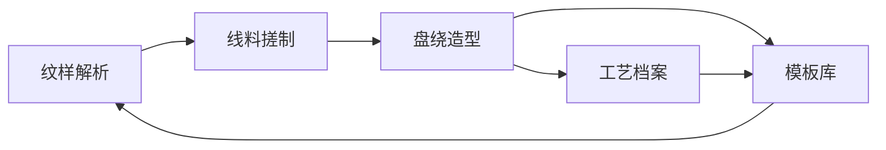
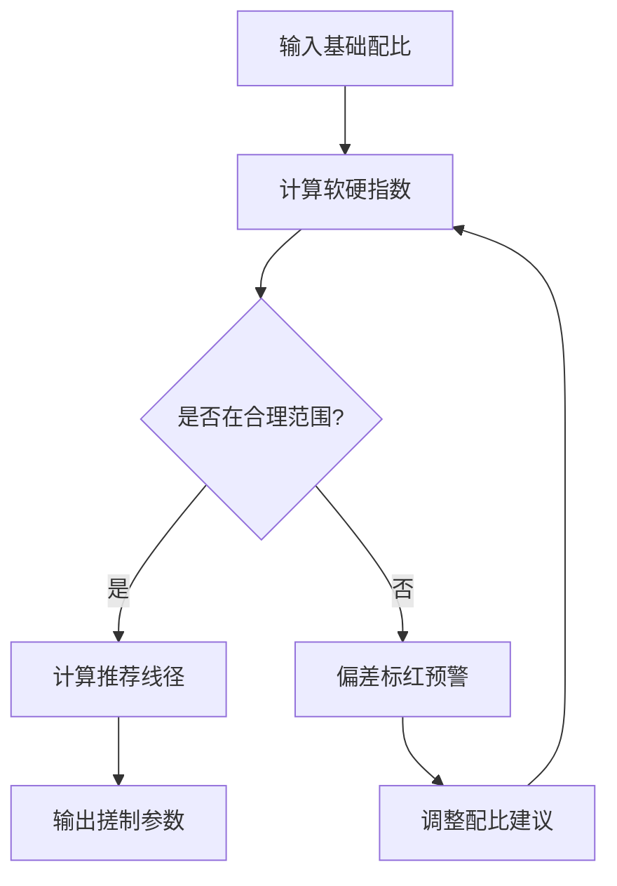

# 漆线雕工艺生产力系统 产品需求文档

## 1. 产品概述

面向传统漆线雕工艺师的数字化生产力工具，实现纹样解析、线料配比计算、盘绕造型模拟、工艺档案管理与模板库沉淀，提升漆线雕创作效率与工艺传承。

- 主要用途：辅助漆线雕工艺师进行纹样规划、线料配制、盘绕造型设计与工艺记录
- 目标用户：漆线雕工艺师、传统工艺从业者、非遗传承人
- 市场价值：将传统工艺数字化，提升创作效率，建立可复用的工艺知识体系

## 2. 核心功能

### 2.1 用户角色

| 角色 | 注册方式 | 核心权限 |
|------|----------|----------|
| 工艺师用户 | 本地应用使用 | 全部功能，管理个人作品档案与模板库 |

### 2.2 功能模块

1. **纹样解析页**：纹样导入、图案识别、走向层次规划
2. **线料搓制页**：线料配比计算、软硬粗细评估、偏差预警
3. **盘绕造型页**：盘绕密度计算、堆叠高度模拟、立体光影预览、工序规划
4. **工艺档案页**：作品记录、盘绕走向档案、风险预警
5. **模板库页**：经典纹样方案、模板管理、快速复用

### 2.3 页面详情

| 页面名称 | 模块名称 | 功能描述 |
|-----------|----------|----------|
| 纹样解析页 | 纹样导入 | 支持图片上传，展示纹样缩略图与基本信息 |
| 纹样解析页 | 图案识别 | 自动识别纹样轮廓、分区与复杂度分析 |
| 纹样解析页 | 走向规划 | 按图案规划漆线盘绕堆叠的走向与层次结构 |
| 纹样解析页 | 层次可视化 | 分层展示漆线路径，可逐层查看与编辑 |
| 线料搓制页 | 配比计算器 | 根据漆料、粉料比例计算线料性能参数 |
| 线料搓制页 | 软硬评估 | 评估线料软硬程度，判断是否适合搓制与盘绕 |
| 线料搓制页 | 粗细调节 | 根据纹样需求计算推荐线径与公差范围 |
| 线料搓制页 | 偏差预警 | 识别线料过软坍塌或过硬易断的偏差并标红警示 |
| 盘绕造型页 | 密度计算 | 计算各部位漆线的盘绕密度与用量估算 |
| 盘绕造型页 | 堆叠高度 | 模拟多层堆叠的高度与层次感 |
| 盘绕造型页 | 干燥校验 | 校验线料干燥状态对盘绕成型的影响 |
| 盘绕造型页 | 立体模拟 | 模拟堆叠造型的立体层次与光影效果 |
| 盘绕造型页 | 工序规划 | 按纹样规划搓线、盘绕、堆叠、贴金的工序流程 |
| 工艺档案页 | 作品列表 | 展示所有作品档案，支持搜索筛选 |
| 工艺档案页 | 作品详情 | 记录每件作品的盘绕走向、参数与工艺要点 |
| 工艺档案页 | 风险预警 | 对线料失水变脆、盘绕断裂等风险进行预警提示 |
| 模板库页 | 模板列表 | 经典纹样的漆线方案展示，支持分类浏览 |
| 模板库页 | 模板详情 | 查看模板的完整参数、适用场景与工艺说明 |
| 模板库页 | 模板管理 | 支持新增、编辑、删除自定义模板 |

## 3. 核心流程

### 主工作流程

用户从纹样解析开始，导入纹样后系统自动分析图案结构，规划漆线走向层次；接着进入线料搓制页面，根据工艺需求调整漆料配比，计算线料软硬粗细，系统提示偏差风险；然后在盘绕造型页面进行密度计算、堆叠模拟与工序规划，预览立体效果；完成的作品可存入工艺档案；优秀方案可存入模板库供后续复用。

### 线料配比计算流程

## 4. 用户界面设计

### 4.1 设计风格

- **主色调**：深朱红 (#8B2323) 作为主色，象征漆线雕的传统底色；金色 (#D4A853) 作为点缀色，呼应贴金工艺
- **辅助色**：墨黑 (#1A1A1A) 背景，牙白 (#F5F0E6) 文字，营造古雅氛围
- **按钮风格**：圆角矩形，朱红底金色描边，悬停时有微微浮起效果
- **字体**：标题使用宋体/明体类衬线字体，体现传统韵味；正文使用清晰易读的无衬线字体
- **布局风格**：卡片式布局，左侧导航 + 主内容区，装饰性边框呼应传统纹样
- **图标风格**：线性图标，金色描边，融入传统纹样元素

### 4.2 页面设计概览

| 页面名称 | 模块名称 | UI 元素 |
|-----------|----------|----------|
| 纹样解析页 | 纹样导入区 | 拖拽上传区域，纹样预览卡片，传统纹样边框装饰 |
| 纹样解析页 | 走向规划区 | 可交互路径图，分层控制面板，颜色编码层次 |
| 线料搓制页 | 配比调节区 | 滑块控件，实时数值显示，配比公式展示 |
| 线料搓制页 | 评估仪表盘 | 软硬指数仪表盘，粗细范围条，偏差状态指示灯 |
| 盘绕造型页 | 造型预览区 | 2.5D 立体模拟画布，光影控制条，角度旋转 |
| 盘绕造型页 | 工序时间轴 | 横向工序流程图，节点状态标识，工时估算 |
| 工艺档案页 | 档案卡片 | 作品缩略图，元数据标签，风险预警徽标 |
| 工艺档案页 | 详情面板 | 参数表格，走向路径图，工艺笔记 |
| 模板库页 | 模板网格 | 卡片式布局，分类标签，悬停放大效果 |
| 模板库页 | 详情抽屉 | 完整参数，适用说明，一键应用按钮 |

### 4.3 响应式设计

- 桌面端优先设计，适配 1440px 及以上宽度
- 平板端自适应布局，导航可折叠
- 移动端简化交互，保留核心功能入口
- 触控优化：增大点击区域，支持手势缩放预览图

### 4.4 动效与交互

- 页面切换采用淡入淡出过渡
- 数据仪表盘数值变化采用平滑滚动动画
- 悬停状态有微妙的阴影与位移变化
- 警告提示采用呼吸灯效果引起注意
- 立体模拟区域支持拖拽旋转视角
