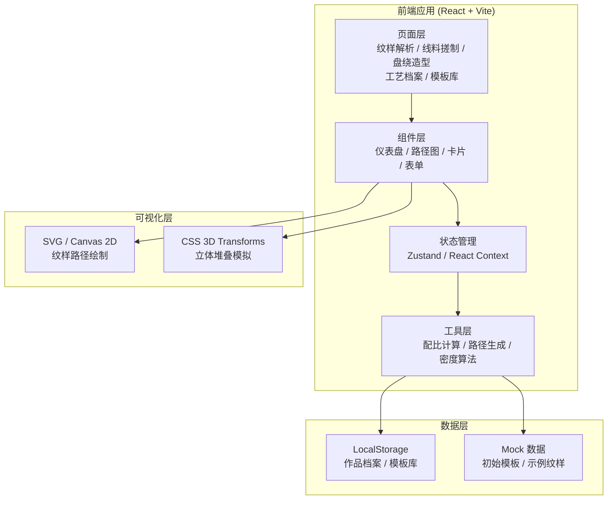

# 漆线雕工艺生产力系统 技术架构文档

## 1. 架构设计



## 2. 技术选型说明

- **前端框架**：React@18 + TypeScript
- **构建工具**：Vite@5
- **样式方案**：TailwindCSS@3 + CSS Variables
- **状态管理**：Zustand（轻量级状态管理）
- **路由**：React Router v6
- **图标**：Lucide React（线性图标库）
- **数据持久化**：LocalStorage
- **可视化**：原生 SVG + Canvas 2D
- **后端**：无（纯前端应用，数据本地存储）

## 3. 目录结构

```
src/
├── assets/          # 静态资源（图片、字体等）
├── components/      # 通用组件
│   ├── Layout/      # 布局组件（侧边栏、顶部导航）
│   ├── UI/          # 基础UI组件（按钮、卡片、仪表盘等）
│   └── Charts/      # 图表与可视化组件
├── pages/           # 页面组件
│   ├── PatternAnalysis/   # 纹样解析页
│   ├── ThreadMaking/      # 线料搓制页
│   ├── CoilingModel/      # 盘绕造型页
│   ├── CraftArchive/      # 工艺档案页
│   └── TemplateLibrary/   # 模板库页
├── store/           # 状态管理
├── utils/           # 工具函数
│   ├── calculator.ts      # 配比计算
│   ├── pathGenerator.ts   # 路径生成
│   └── densityCalc.ts     # 密度计算
├── data/            # Mock 数据
├── types/           # TypeScript 类型定义
├── hooks/           # 自定义 Hooks
├── App.tsx
├── main.tsx
└── index.css
```

## 4. 路由定义

| 路由路径 | 页面名称 | 说明 |
|----------|----------|------|
| `/` | 首页（纹样解析） | 默认首页，纹样导入与分析 |
| `/pattern` | 纹样解析页 | 纹样导入、图案识别、走向规划 |
| `/thread` | 线料搓制页 | 配比计算、软硬评估、偏差预警 |
| `/coiling` | 盘绕造型页 | 密度计算、堆叠模拟、工序规划 |
| `/archive` | 工艺档案页 | 作品列表、详情查看、风险预警 |
| `/templates` | 模板库页 | 模板浏览、详情查看、管理操作 |

## 5. 数据模型

### 5.1 纹样数据模型

```typescript
interface Pattern {
  id: string;
  name: string;
  description: string;
  category: string;
  imageUrl?: string;
  complexity: number; // 1-5 复杂度
  layers: PatternLayer[];
  createdAt: string;
  updatedAt: string;
}

interface PatternLayer {
  id: string;
  name: string;
  order: number; // 层次顺序
  paths: PathData[];
  color: string;
  visible: boolean;
}

interface PathData {
  id: string;
  points: Point[];
  width: number; // 线宽
  coilingDensity: number; // 盘绕密度
}

interface Point {
  x: number;
  y: number;
}
```

### 5.2 线料配比模型

```typescript
interface ThreadMixture {
  id: string;
  name: string;
  lacquerRatio: number; // 漆料比例 0-100
  powderRatio: number;  // 粉料比例 0-100
  oilRatio: number;     // 油类比例 0-100
  hardnessIndex: number; // 软硬指数 0-100
  recommendedDiameter: number; // 推荐线径 mm
  tolerance: { min: number; max: number }; // 公差范围
  suitableForCoiling: boolean;
  warnings: WarningItem[];
}

interface WarningItem {
  type: 'soft' | 'hard' | 'thin' | 'thick' | 'dry';
  level: 'info' | 'warning' | 'danger';
  message: string;
}
```

### 5.3 盘绕造型模型

```typescript
interface CoilingModel {
  id: string;
  patternId: string;
  threadMixtureId: string;
  layers: CoilingLayer[];
  totalHeight: number; // 总堆叠高度 mm
  totalLength: number; // 总用线长度 m
  dryTime: number; // 干燥时间 小时
  processSteps: ProcessStep[];
}

interface CoilingLayer {
  id: string;
  layerOrder: number;
  density: number; // 盘绕密度
  height: number;  // 高度
  threadDiameter: number; // 线径
}

interface ProcessStep {
  id: string;
  name: string;
  duration: number; // 分钟
  description: string;
  dependencies: string[]; // 依赖步骤ID
}
```

### 5.4 工艺档案模型

```typescript
interface CraftRecord {
  id: string;
  title: string;
  patternName: string;
  coilingModel: CoilingModel;
  threadMixture: ThreadMixture;
  creationDate: string;
  completionDate?: string;
  status: 'planning' | 'in-progress' | 'completed' | 'failed';
  riskAlerts: RiskAlert[];
  notes: string;
  images: string[];
}

interface RiskAlert {
  id: string;
  type: 'brittleness' | 'fracture' | 'collapse' | 'dryness';
  level: 'low' | 'medium' | 'high';
  message: string;
  suggestion: string;
  timestamp: string;
}
```

### 5.5 模板模型

```typescript
interface Template {
  id: string;
  name: string;
  category: string;
  description: string;
  thumbnail: string;
  pattern: Pattern;
  threadMixture: ThreadMixture;
  coilingModel: CoilingModel;
  useCount: number;
  rating: number;
  createdAt: string;
  isCustom: boolean;
}
```

## 6. 核心算法说明

### 6.1 线料软硬指数计算

```
软硬指数 = 漆料比例 × 0.6 + 粉料比例 × 0.3 - 油类比例 × 0.5
合理范围：35 - 65
  - < 35：过软，易坍塌
  - 35-50：偏软，适合精细盘绕
  - 50-65：偏硬，适合堆叠造型
  - > 65：过硬，易断裂
```

### 6.2 盘绕密度计算

```
区域密度 = 该区域漆线总长度 / 区域面积
堆叠高度 = 单根线径 × 层数 × 堆叠系数 (0.85-0.95)
总用线量 = Σ(各段路径长度 × 密度系数)
```

### 6.3 干燥时间估算

```
基础干燥时间 = 环境温度倒数 × 湿度系数 × 线径系数
实际干燥时间 = 基础时间 × 堆叠层数因子 × 通风因子
```

## 7. 性能与质量保障

- 使用 React.memo 优化渲染性能
- 列表采用虚拟滚动处理大量数据
- SVG 路径渲染使用 requestAnimationFrame 优化
- 使用 TypeScript 确保类型安全
- 组件化设计，保证可维护性
- LocalStorage 数据定期备份与清理机制
